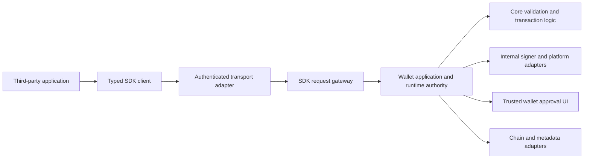

# OPTN Wallet integration SDK technical specification

Status: **implementation specification; SDK remains work in progress**.

> **Current implementation note (2026-10-05):** Generic CashScript support is
> now implemented for the private TypeScript SDK using ABI-shaped artifacts.
> The current public contract is described in
> [`packages/addon-sdk/README.md`](../packages/addon-sdk/README.md) and its
> runnable examples. Historical sections that defer all contracts to a future
> registry describe the original design rationale; they do not override the
> current artifact API. Registry and provenance controls remain future work.

Revision: 0.1, 2026-10-04. This document defines the target, implementation order,
and evidence required before third-party developers are invited to use it.
Requirements below describe future behavior unless explicitly labelled current.
Creating this document does not authorize live signing, broadcasting, publishing,
or implementation changes beyond documentation.

Reading guide:

- [Source gaps](#2-source-baseline-and-concrete-gaps) and [architecture](#4-architecture-and-ownership).
- [Permissions](#5-app-identity-sessions-and-permissions), [protocol types](#6-public-protocol-and-data-model), and [public API](#7-target-public-api).
- [Signer handling](#8-signers-and-private-key-handling) and [transaction approval](#9-transaction-proposals-approval-and-signing).
- [CashScript/Libauth references](#10-cashscript-libauth-and-contract-integration) and [operation recovery](#11-operation-lifecycle-concurrency-and-recovery).
- [File ownership](#15-implementation-ownership-and-work-packages), [delivery phases](#16-delivery-phases-and-exit-criteria), and [readiness gates](#18-third-party-readiness-gates).

## 1. Goal and scope

Provide a versioned SDK through which third-party developers can integrate their
applications with OPTN Wallet and use its wallet, transaction, contract, token,
and infrastructure tools. Secrets remain under the user's control within the
wallet or approved signer, and OPTN Wallet controls access to every privileged
operation. Developers submit requests and receive defined public data,
signatures, operation results, and scoped events.

The SDK security model must be independent of how an application is rendered or
how messages travel. The existing iframe is a temporary integration adapter and
is not the basis of the SDK contract. External applications and installed
add-ons must use the same authorization and signing use cases where their
supported protocols allow it.

### 1.1 Outcomes

An integrator can:

- Discover the API version, supported networks, operations, and platform limits.
- Connect with explicit requested permissions and a wallet-selected account scope.
- Obtain permitted public addresses and public keys without learning wallet secrets.
- Read scoped balances, public UTXOs, token metadata, and chain observations.
- Request a signature from a particular approved identity without receiving its key.
- Propose BCH/CashToken payments and supported contract transitions.
- Have the wallet validate and present the exact operation for approval.
- Observe signing, submission, mempool, and confirmation outcomes separately.
- Handle denial, stale state, disconnects, retries, hardware signing, and revocation.

The initial developer release must support a useful, bounded subset of these
operations. Unsupported operations return an explicit error and are omitted
from advertised availability. Contract signing and additional identity schemes
can follow the basic connection, read, message, and payment release.

### 1.2 Security invariants

| ID     | Requirement                                                                                                                                                                                          |
| ------ | ---------------------------------------------------------------------------------------------------------------------------------------------------------------------------------------------------- |
| SEC-01 | No third-party response, event, log, error, debug export, or object may contain a wallet-owned mnemonic, BIP39 passphrase, private key, WIF, xprv, secret storage credential, or internal key cache. |
| SEC-02 | Public signer references are identifiers, not authorization. Every use is checked against authenticated app identity, session, wallet/account, network, purpose, grants, and current wallet state.   |
| SEC-03 | A capability declaration is permission to request access. Host policy and user grants determine effective access.                                                                                    |
| SEC-04 | Package metadata, a caller-supplied ID, and a caller-supplied trust tier cannot establish authority.                                                                                                 |
| SEC-05 | Unsigned construction, public derivation, metadata lookup, and read operations never fetch a spending key or produce a signature.                                                                    |
| SEC-06 | Every signature commits to a defined, validated operation approved under the applicable wallet policy. No unrestricted signing oracle is exposed.                                                    |
| SEC-07 | Approval is bound to immutable operation content and current authority. Any material change requires a new proposal and approval.                                                                    |
| SEC-08 | Inputs, source outputs, BCH values, token transitions, fees, change, and required successors are validated independently of add-on assertions.                                                       |
| SEC-09 | Missing policy, unsupported signing, ambiguous state, or failed validation causes explicit denial. No weaker fallback is selected silently.                                                          |
| SEC-10 | Duplicate requests, concurrent operations, timeouts, restarts, and partial network failure must not cause a second unauthorized effect.                                                              |
| SEC-11 | Lock, wallet/network switch, disconnect, revocation, and relevant app changes invalidate pending authority at the runtime boundary.                                                                  |
| SEC-12 | Third-party access cannot expose unrestricted application actions, wallet security commands, arbitrary native IPC, filesystem, secure storage, or provider configuration.                            |

These invariants address malicious and buggy integrations. They do not make
untrusted code safe if it is granted execution inside the wallet's privileged
process or renderer with direct access to wallet internals. Removing an iframe
must preserve a suitable execution/isolation boundary or move integration code
outside the wallet. A capability API cannot contain code that can bypass it.

## 2. Source baseline and concrete gaps

The review baseline is OPTNWallet commit
`c975268073d857064997b02bf45dca69a017492d`, inspected locally on 2026-10-04.
Local unrelated changes were present and excluded from this documentation task.
Recheck the implementation before applying a phase; this is a source snapshot,
not a claim that all Rust targets are active shipping surfaces.

| Current source                                                                                | Observed behavior                                                                                                  | Required change                                                                                                                         |
| --------------------------------------------------------------------------------------------- | ------------------------------------------------------------------------------------------------------------------ | --------------------------------------------------------------------------------------------------------------------------------------- |
| [`src/services/AddonsSDK.ts`](../src/services/AddonsSDK.ts)                                   | Capability-scoped service facade, with optional runtime authorizer and `@ts-nocheck`.                              | Strict request/result types; mandatory authority for privileged use cases; thin compatibility client over application/runtime handlers. |
| Same file, `signing.signatureTemplateForAddress`                                              | Fetches an address private key and returns `new SignatureTemplate(pk, HashType.SIGHASH_ALL)`.                      | Remove third-party access to templates and replace with internal operation-specific signing.                                            |
| Same file, `tx.build`                                                                         | Calls `TransactionManager.buildTransaction` with caller-supplied inputs/outputs.                                   | Unsigned proposal construction with wallet-resolved inputs and explicit validation.                                                     |
| [`TransactionBuilderHelper.ts`](../src/apis/TransactionManager/TransactionBuilderHelper.ts)   | Fetches keys for normal wallet inputs and gives signing unlockers to CashScript's builder.                         | Preserve valid internal uses; prohibit this path from being mistaken for unsigned SDK construction.                                     |
| [`MarketplaceAppHost.tsx`](../src/pages/apps/MarketplaceAppHost.tsx)                          | Reads manifest `internal` trust, can omit runtime authorization, persists capability consent by wallet/add-on/app. | Move authority to runtime; verified app identity, scoped grants, content-specific approval, revocation and expiry.                      |
| [`AddonPolicyEngine.ts`](../src/services/addons/AddonPolicyEngine.ts)                         | Per-instance rates, optional authorization, in-memory audit, `Promise.race` timeout.                               | Runtime-owned budgets, required authorization, cancellation/reconciliation, durable mutation identity.                                  |
| [`AddonsAllowlist.ts`](../src/services/AddonsAllowlist.ts)                                    | Initial URL/domain checks, global domain list, manifest permissions.                                               | Prefer typed infrastructure operations; optional HTTP requires complete request/redirect/response policy.                               |
| [`AddonInstallService.ts`](../src/platform/desktop/AddonInstallService.ts)                    | Desktop folder copy; accepts supplied manifest; writes manifest before all bundle copies finish.                   | Authenticated provenance and content binding; atomic install/update; grant and runtime lifecycle handling.                              |
| [`AddonsRegistry.ts`](../src/services/AddonsRegistry.ts)                                      | Cached manifests and capabilities; no complete update/revocation lifecycle.                                        | Registry identity and runtime grants are distinct; invalidate caches and active authority on changes.                                   |
| [`SDKContract.ts`](../src/services/addons/SDKContract.ts)                                     | Current WIP constant `1.6.0`; hand-maintained method metadata.                                                     | One schema/version source, generated clients/reference, explicit breaking migration.                                                    |
| [`crates/optn-core/src/addon.rs`](../crates/optn-core/src/addon.rs)                           | Capability/policy primitives still include signature-template capability.                                          | Align Rust policy vocabulary with safe operations; core policy helpers alone do not enforce a live session.                             |
| [`crates/optn-core/src/connect.rs`](../crates/optn-core/src/connect.rs)                       | Typed BCH signing context, token serialization, duplicate-input checks, `0x41`/`0x61` modes.                       | Reuse audited semantics behind SDK authorization; extend conformance where needed.                                                      |
| [`crates/optn-runtime/src/wallet_security.rs`](../crates/optn-runtime/src/wallet_security.rs) | Wallet operation access bound to wallet state and unlock epoch.                                                    | Use as a boundary for internal signer integration; add operation approval and app scope.                                                |
| [`crates/optn-transport/src/security.rs`](../crates/optn-transport/src/security.rs)           | Trusted wallet security commands include credential-bearing requests.                                              | Never make this trusted renderer contract callable by third parties.                                                                    |

Earlier dispatcher/SDK unit checks covered existing behavior. They did not
prove absence of key-bearing responses, valid spend approval, native isolation,
or production readiness. All readiness evidence must be attached to the final
implementation and platform under review.

## 3. Threat model

Assume an integration can send arbitrary protocol messages, lie about its
identity and intent, replay requests, race a wallet switch, mutate package
contents, flood prompts, and submit malformed transaction or contract data.
An integration that is legitimate today may become malicious after an update.
Network providers may fail, disagree, return stale data, or accept a submission
without delivering a response.

| Attack or failure                                                             | Mandatory boundary                                                                                         |
| ----------------------------------------------------------------------------- | ---------------------------------------------------------------------------------------------------------- |
| Request a key, mnemonic, internal object, debug template, or security command | Closed method protocol and explicit public result serialization; deny unknown operations.                  |
| Claim to be a trusted built-in or another app                                 | Host-attested connection identity and verified package/origin binding.                                     |
| Reuse another session's signer/proposal/operation ID                          | Ownership checks on every resource, with opaque IDs that carry no standalone authority.                    |
| Gain permission once and sign an unrelated payload later                      | Separate capability grant from per-operation approval.                                                     |
| Change recipients, tokens, source outputs, or signing mode after review       | Immutable proposal and approval commitment checked immediately before signing.                             |
| Use another wallet's inputs or derivation paths                               | Runtime resolves key ownership from its wallet; external key paths and wallet IDs do not select authority. |
| Supply fake UTXO value/script/token data                                      | Resolve and reconcile source outputs through wallet/provider policy, then compare.                         |
| Drain values via fees/change or burn NFTs                                     | Explicit value/token accounting and trusted review of all changes.                                         |
| Retry after a timeout or crash                                                | Operation journal, atomic reservations, idempotency and status reconciliation.                             |
| Embed app text in trusted approval UI                                         | Wallet-owned labels and layout; bounded plain text, with untrusted descriptions identified.                |
| Turn wallet networking into SSRF or data export                               | Typed infra APIs first; separate egress grant and constrained HTTP policy if enabled.                      |

Host compromise, a compromised OS, malicious signer firmware, or a bug in the
cryptographic implementation remain distinct risks. Document platform
assumptions without using them to weaken SDK authorization.

## 4. Architecture and ownership

### 4.1 Request flow



This is a request-flow diagram, not a crate dependency diagram. The gateway
converts a closed SDK request into an application use case. It does not forward
arbitrary `AppAction`, trusted renderer commands, native calls, or arbitrary
provider objects. The client and transport are never the final authorizer.

### 4.2 Layer responsibilities

| Layer                        | Owns                                                                                                                                            | Must not own                                                                         |
| ---------------------------- | ----------------------------------------------------------------------------------------------------------------------------------------------- | ------------------------------------------------------------------------------------ |
| `optn-core`                  | BCH/CashToken encoding, signing serialization, transaction invariants, contract/public derivation, signature verification, pure policy helpers. | User prompts, transport sessions, OS APIs, authoritative live wallet state.          |
| `optn-app`                   | SDK use cases, request validation decisions, proposals, approval states and review models, scoped events and error meaning.                     | Leptos/Tauri types, native IPC details, framework lifecycle objects.                 |
| `optn-runtime`               | Sessions/grants, wallet binding, authority checks, reservations, operation journal, signer coordination, sync/evidence, submission/recovery.    | Rendering, untrusted plugin execution, UI-owned authorization.                       |
| `optn-transport`             | Versioned closed wire schema, request/result/event envelopes and generic transport contracts.                                                   | Secret-bearing wallet security routes in the third-party contract.                   |
| `optn-platform` and adapters | Secure storage, hardware capabilities and native I/O behind typed contracts.                                                                    | Choosing the user's spend intent or treating app permission as signer authorization. |
| `optn-ui` or current UI      | Trusted review, identity/account selection, grants, revoke/disconnect controls and status presentation.                                         | Final signing permission, transaction truth or hidden key retrieval.                 |
| Public SDK package           | Language bindings, schema validation, feature discovery, ergonomic methods, transport cancellation and status handling.                         | Wallet secrets, local signing authority, direct wallet/provider services.            |

The current package work lives in `packages/addon-sdk`. It is a private,
dependency-free TypeScript client contract with a closed method surface,
response projection, cancellation-aware transport interface, and no wallet
implementation imports. Its current third-party surface includes ABI-shaped
CashScript derivation and proposal methods. Artifact provenance and registry
controls remain future distribution policy; they are not required for the
generic wallet-owned execution boundary. Its private
guard remains until the wire protocol and release evidence are frozen. The
package entrypoint also performs fail-closed manifest shape validation, while
publisher identity, allowlists, consent, and runtime grants remain host-owned.

Use existing modules where they fit. Proposed module names in section 15 are
planning locations, not a requirement to create a parallel implementation.
Keep framework dependency invariants in `RUSTIFICATION.md` and run the
architecture check when implementing changes in these layers.

### 4.3 Integration transports

The first shipped adapter must authenticate which peer a request came from and
bind the peer to a runtime session. Installed packages need verified content
identity; external apps need the identity assurance provided by the supported
connection protocol, with its limits visible to users. A displayed name or
URL supplied by the requester is untrusted metadata.

WalletConnect or another connector can translate its supported methods into
the same application use cases. Existing connector semantics must retain their
conformance and approval rules; sharing use cases does not imply identical
wire formats or automatic support for every SDK capability.

The existing iframe adapter may remain temporarily. Its responsibility is
isolation and authenticated message delivery. Replacing it must preserve those
properties through another boundary. No transport-specific types belong in
the public domain request types. Arbitrary third-party code must not be loaded
as a privileged Rust/native plugin or same-realm wallet component.

The WIP TypeScript package now includes a versioned, cancellation-aware
`postMessage` transport adapter. Each request carries the host-issued,
session-scoped identifier and is accepted only from the authenticated peer for
that session. The iframe bridge accepts that envelope as a compatibility path
while retaining its older built-in message shape. Opaque
origins require an explicit adapter opt-in; ordinary connectors must provide an
explicit target origin. This compatibility layer does not make the iframe the
long-term public protocol.

The connection response includes an expiry timestamp. The SDK validates that
timestamp before creating a transport, rejects new requests after expiry, and
automatically disposes the transport at the deadline. Disposal rejects pending
requests with a session-expired error so lock, disconnect, and expiry paths do
not depend on request timeouts or host reachability.

## 5. App identity, sessions and permissions

### 5.1 Identity record

Runtime records an `IntegrationPrincipal` containing:

- Host-assigned principal ID and integration kind.
- Verified publisher/package/content identity for installed apps, or
  transport-attested peer/origin identity for external apps.
- Display name, icon and description with their verification level.
- Declared API compatibility, requested methods and egress destinations.
- Host-assigned policy tier and current package/content revision.

The caller cannot select this record by supplying `addonId`, `walletId`, a
publisher string, or `trustTier`. Unsigned local development packages receive
a content-bound development identity and restrictive policy; a local folder
or an approval click does not establish a verified publisher.

Publisher rotation and changes to content, endpoints or peer identity never
inherit authority based only on matching display names. Host policy may allow
verified continuity after explicit review; phase 1 defaults to reconsent.

### 5.2 Session record

A session binds principal, protocol version, adapter/peer identity, approved
account handles, network, grants, grant revision, creation/expiry time and the
current authority epoch. Session handles are random opaque identifiers and
must not expose database IDs, secrets or derivation roots. Possession of an ID
is insufficient to use another peer's session.

Connection establishes read access and permission to request privileged
operations. It does not unlock a wallet, approve a spend or grant a permanent
signing right. Unlock and authentication occur only through trusted wallet UI.
Disconnected/revoked resources must be inaccessible even if stale UI remains.

### 5.3 Effective permissions

```text
effective permission = intersection of
  requested operation
  verified principal/session scope
  explicit user grant
  wallet policy
  platform/signer support
  current wallet/account/network/authority state
```

All terms are evaluated by the wallet. The manifest contributes requests, not
grants. Built-in status comes from the host's compiled registry/provenance and
cannot be impersonated by an installed manifest.

Grant records bind principal identity, package revision/origin policy, wallet
and account scope, network, capabilities, allowed signer purposes, creation
and expiry, and revocation revision. Initial rollout grants are bounded to
the current content revision; an update requires fresh consent. Later
publisher-continuity rules require explicit policy and tests.

Read grants may be remembered after explicit consent. Privileged capabilities
allow an app to request approval; the initial release never offers unrestricted
"always sign" or "always broadcast" consent. Future unattended use requires a
separate delegation design with budgets, destinations, expiry and revocation.

### 5.4 Proposed capability vocabulary

| Capability                       | Meaning and scope                                                                                       |
| -------------------------------- | ------------------------------------------------------------------------------------------------------- |
| `accounts:read`                  | List only the accounts selected for this session.                                                       |
| `addresses:receive`              | Request a receive address under wallet discovery/gap policy; no signing.                                |
| `signers:public`                 | Read public descriptors of approved signer identities.                                                  |
| `balances:read`                  | Read balances for granted accounts, with observation evidence.                                          |
| `utxos:read`                     | Read public outpoints for granted accounts; no key recipes, internal unlockers or mutation.             |
| `chain:read`                     | Bounded public chain queries through wallet-selected adapters.                                          |
| `metadata:read`                  | Token metadata and provenance/freshness, not authority over tokens.                                     |
| `tokenindex:read`                | Bounded public indexing queries when available on the selected network.                                 |
| `sync:request`                   | Ask runtime to refresh a scoped view; coalesced and rate limited.                                       |
| `messages:request-signature`     | Submit a supported message for wallet review and internal signing.                                      |
| `transactions:propose`           | Create an unsigned immutable proposal; never signing.                                                   |
| `transactions:request-execution` | Request review/sign/submission of an owned proposal.                                                    |
| `contracts:derive`               | Pure ABI-shaped artifact derivation; no signer, provider or live side effect.                              |
| `contracts:propose`              | ABI-shaped function intent with explicit input indexes; wallet-owned review, signing and submission.       |
| `operations:read`                | Read status/results of this principal's operations only.                                                |
| `events:subscribe`               | Subscribe to the subset of permitted views and owned operation events.                                  |
| `transactions:export-signed`     | Optional later feature: export an explicitly approved signed artifact.                                  |
| `http:request`                   | Optional later feature: constrained proxy requests with separate egress policy.                         |

These names are proposed. Freeze the enum, method mapping and versioned
schemas together in phase 1. Do not retain unsafe legacy capabilities merely
to avoid a breaking change.

The current WIP TypeScript host uses the narrower capability
`tx:operation:read` for `tx.getOperation()`. It is an implementation mapping
of the proposed `operations:read` concept and must be reconciled before a
versioned external protocol is frozen.

## 6. Public protocol and data model

### 6.1 Versioning and envelopes

The redesigned API is a breaking contract; target a new major SDK version
(proposed `2.0.0`, separate from the current `1.6.0` WIP constant). Wire protocol
version and package version are distinct. Negotiation selects one supported
wire version; there is no fallback to unsafe legacy signing.

```ts
type RequestEnvelope<P> = {
  protocolVersion: 2;
  requestId: string;
  sessionId: string;
  method: SdkMethod; // closed enum, not arbitrary object member lookup
  params: P;
  idempotencyKey?: string; // mandatory for all effect-producing requests
};

type ResponseEnvelope<T> =
  | { protocolVersion: 2; requestId: string; ok: true; result: T }
  | { protocolVersion: 2; requestId: string; ok: false; error: SdkError };

type OperationRef = { operationId: string };
type Outpoint = { txid: string; outputIndex: number };
type Hex = string; // runtime validated by field-specific length/format rules
type Amount = string; // canonical unsigned decimal integer, base units
```

`meta.getInfo` and session establishment have separately defined pre-session
envelopes. They return only global feature metadata and connection decisions,
never a wallet inventory before consent. Authentication context comes from the
adapter/runtime, not fields copied blindly from this envelope.

Reject unknown methods, unknown security-relevant fields, invalid argument
shapes, invalid UTF-8/hex, noncanonical amounts, integer overflows, duplicate
IDs/outpoints, prototype-related properties and oversized/deep objects. Never
merge incoming objects into policy/configuration or dispatch inherited object
members. Validate before allocating expensive resources.

### 6.2 Public handles and views

```ts
type AccountView = {
  accountId: string; // session-scoped opaque handle
  name: string;
  network: 'mainnet' | 'chipnet';
  signingAvailability: 'software' | 'hardware' | 'external' | 'watch-only';
};

type SignerView = {
  signerId: string; // binds internally to account/key/purpose; no authority
  accountId: string;
  publicKeyHex: Hex;
  address?: string;
  purpose: 'wallet-spend' | 'app-identity';
  supportedOperations: string[];
};

type PublicUtxo = {
  outpoint: Outpoint;
  accountId: string;
  lockingBytecodeHex: Hex;
  valueSats: Amount;
  token?: {
    category: Hex;
    amount: Amount;
    nft?: { capability: 'none' | 'mutable' | 'minting'; commitmentHex: Hex };
  };
  availability: 'available' | 'reserved' | 'frozen';
  observation: {
    state: 'mempool' | 'confirmed' | 'unknown';
    observedAt: string;
    blockHash?: Hex;
    blockHeight?: number;
    sourceClass: string;
  };
};
```

All amounts use base units and canonical decimal strings: no negative values,
scientific notation, rounding or implicit token decimals. Display metadata
does not determine token category, amount, NFT capability or commitment.
Hex fields have defined byte order and field-specific length rules. Txids and
category IDs use documented display order; wire serialization conversion
belongs to core logic and conformance vectors.

Public UTXOs are projections, not existing `UTXO` objects. Exclude internal
wallet IDs, signing unlockers, contract callbacks, key derivation recipes,
hardware credentials and runtime-only metadata. Address/UTXO enumeration is
privacy-sensitive and requires a grant. Full xpub export is not a default read
permission; any future support needs an explicit separate privacy grant.

For the current TypeScript package wire contract, proposal inputs use the
chain-facing fields `tx_hash`, `tx_pos`, `value`, and `height`; the wallet's
internal proposal records use `txid`, `vout`, and `valueSats` and must never
cross the public or iframe bridge directly. Both the direct public facade and
the temporary iframe adapter apply this projection before returning a proposal.
Executable unlockers and callback fields are rejected at proposal creation,
rather than silently dropped.

Every view is scoped and carries freshness/evidence where relevant. A cached
or unknown view cannot authorize a spend merely because it is present.

### 6.3 Errors

Stable machine-readable codes include:

| Code                                                                    | Caller action                                                               |
| ----------------------------------------------------------------------- | --------------------------------------------------------------------------- |
| `INVALID_REQUEST`                                                       | Correct input; do not retry unchanged.                                      |
| `UNSUPPORTED_VERSION` / `UNSUPPORTED_OPERATION` / `UNSUPPORTED_NETWORK` | Use negotiated features or stop.                                            |
| `PERMISSION_DENIED` / `USER_REJECTED`                                   | Respect denial; never start a retry prompt loop.                            |
| `SESSION_EXPIRED` / `SESSION_REVOKED`                                   | Reconnect with explicit user consent if appropriate.                        |
| `WALLET_LOCKED` / `STALE_CONTEXT`                                       | Let the user restore wallet context; old approval is invalid.               |
| `STALE_PROPOSAL` / `UTXO_UNAVAILABLE`                                   | Rebuild and review a new proposal.                                          |
| `VALIDATION_FAILED` / `SIGNER_UNAVAILABLE`                              | Display bounded explanation; no weaker fallback.                            |
| `RATE_LIMITED` / `RESOURCE_LIMIT`                                       | Respect retry-after or reduce workload.                                     |
| `IDEMPOTENCY_CONFLICT`                                                  | Same key used with different content; fix integration logic.                |
| `OPERATION_PENDING` / `SUBMISSION_UNKNOWN`                              | Query the existing operation; do not create a new spend.                    |
| `OPERATION_NOT_FOUND`                                                   | Resource is missing or inaccessible; do not reveal another app's existence. |

Errors contain code, safe message, retry guidance and optional operation ID.
They never contain raw key-service errors, database rows, private paths,
credentials, request bodies or stack traces. Provider diagnostics are mapped
to safe categories. Logs require the same treatment as responses.

### 6.4 Proposed operation payloads

These are proposed public DTOs, not internal transaction/signing objects.
The wire schema must define every listed reference type before phase 1 exits.

```ts
type PaymentIntent = {
  accountId: string;
  payments: Array<{ address: string; amountSats: Amount }>;
  tokenTransfers: Array<{
    address: string;
    category: Hex;
    amount: Amount;
    nftOutpoint?: Outpoint; // selects an existing NFT; no implicit mutation
  }>;
  selectedOutpoints?: Outpoint[]; // optional hints, independently resolved
  maxFeeSats: Amount;
};

type CashTokenIntent =
  | { kind: 'transfer' }
  | {
      kind: 'mint-fungible';
      category: Hex;
      amount: Amount;
      nft?: {
        capability: 'none' | 'mutable' | 'minting';
        commitmentHex: Hex;
      };
    }
  | {
      kind: 'mint-nft';
      category: Hex;
      capability: 'none' | 'mutable' | 'minting';
      commitmentHex: Hex;
    }
  | {
      kind: 'mutate-nft';
      category: Hex;
      source: {
        capability: 'mutable' | 'minting';
        commitmentHex: Hex;
      };
      target: {
        capability: 'none' | 'mutable' | 'minting';
        commitmentHex: Hex;
      };
    }
  | {
      kind: 'burn';
      category: Hex;
      amount?: Amount;
      nft?: {
        capability: 'none' | 'mutable' | 'minting';
        commitmentHex: Hex;
      };
    };

type MessageSignIntent = {
  signerId: string;
  scheme: 'bch-signed-message';
  message: string; // exact UTF-8 bytes; no silent normalization
};

type SignatureResult = {
  operationId: string;
  signerId: string;
  scheme: 'bch-signed-message';
  encoding: 'base64-compact'; // must match verified existing scheme vectors
  signature: string;
  publicKeyHex: Hex;
  address: string;
};

type ProposalView = {
  proposalId: string;
  revision: number;
  accountId: string;
  network: 'mainnet' | 'chipnet';
  approvalCommitment: Hex;
  expiresAt: string;
  inputs: PublicUtxo[];
  outputs: Array<{
    outputIndex: number;
    lockingBytecodeHex: Hex;
    valueSats: Amount;
    token?: PublicUtxo['token'];
    role: 'payment' | 'change' | 'contract-successor' | 'data';
  }>;
  feeSats: Amount;
  maxFeeSats: Amount;
  executionModes: Array<'wallet-submit' | 'signed-export'>;
  review: PublicReviewSummary; // derived from the immutable validated plan
  tokenIntent?: CashTokenIntent;
};

type SdkError = {
  code: SdkErrorCode;
  message: string;
  retry: 'never' | 'query-operation' | 'after-delay' | 'new-review';
  retryAfterMs?: number;
  operationId?: string;
};

type ExecutionOperation = {
  operationId: string;
  txid?: Hex; // public correlation metadata, never raw transaction data
  status:
    | 'awaiting_approval' | 'signing' | 'submitting'
    | 'submission_unknown' | 'mempool' | 'confirmed' | 'rejected';
};
```

Wire request idempotency is carried in the envelope; an ergonomic client can
accept `idempotencyKey` beside these intent fields and encode it there. Payment
NFT selection must resolve category/capability/commitment from its source and
preserve it. Protocol limits constrain category/commitment lengths and base-unit
ranges. The public proposal contract has distinct explicit schemas for
fungible minting, NFT minting, NFT mutation, and burning. Ordinary transfers
cannot change fungible totals or NFT state implicitly. These schemas describe
and validate intent; they do not grant an add-on a signer or enable token
execution before the host authority gate passes.

For CashTokens, the concrete limits are a 32-byte category, a fungible amount
from `1` through `9223372036854775807`, an NFT commitment of zero through
40 bytes encoded as even-length hexadecimal, and at least 1,000 satoshis on
each token-bearing output. A zero fungible amount is only valid alongside an
NFT. A transfer may contain several categories and NFT states, while an
explicit mint, mutation, or burn intent addresses one category per proposal.
The wallet must preserve token-aware change, genesis input requirements,
minting-capability authority, mutable-versus-immutable NFT rules, and explicit
burn accounting when it enables execution.

`signed-export` is advertised only when separately implemented and granted.
Results and features are discriminated by supported scheme/operation; future
schemes add explicit versions instead of silently changing base64 encoding or
signature interpretation. Freeze interoperability vectors before treating
`base64-compact` as a published promise. Operation status DTOs must include
current stage, revisions, timestamps, effect/artifact state, safe result/error
and separate chain/submission evidence; one boolean `success` is insufficient.

## 7. Target public API

The table defines the intended high-level surface. Generated clients may add
helpers such as `waitForOperation`; those helpers do not change authority.

| Module/method                                      | Input                                                    | Public result                                      | Privileged effect                                                   |
| -------------------------------------------------- | -------------------------------------------------------- | -------------------------------------------------- | ------------------------------------------------------------------- |
| `meta.getInfo()`                                   | None                                                     | Versions, features, limits, network/signer support | None; pre-consent metadata only.                                    |
| `sessions.connect()`                               | Requested capabilities/account selection hints           | Scoped session and granted capabilities            | Trusted connection/grant review.                                    |
| `sessions.get()` / `disconnect()`                  | Current session                                          | Scoped state / completion                          | Disconnect revokes pending authority.                               |
| `accounts.list()`                                  | Session                                                  | Approved account views                             | None.                                                               |
| `addresses.requestReceive()`                       | Account handle                                           | Public receive address                             | Wallet address issuance/gap policy only.                            |
| `signers.request()`                                | Account handle and supported purpose                     | Approved public signer descriptor                  | Identity selection; no private derivation path supplied by app.     |
| `balances.get()` / `utxos.list()`                  | Account, pagination                                      | Explicit scoped views                              | None.                                                               |
| `chain.getTip()` / `getTransaction()`              | Network-scoped ID                                        | Bounded public view with evidence                  | Read through wallet-selected provider.                              |
| `metadata.getToken()` / `tokenIndex.listHolders()` | Category and bounded options                             | Public metadata/index result with provenance       | Read; explicit network support.                                     |
| `sync.request()`                                   | Account and idempotency key                              | Operation reference                                | Coalesced runtime refresh; no direct DB writes.                     |
| `signing.requestMessage()`                         | Signer handle, scheme and exact payload                  | Operation reference; later signature result        | Trusted message review and internal signing.                        |
| `transactions.propose()`                           | Payment/contract intent and idempotency key              | Immutable proposal and public review summary       | Unsigned construction and bounded preparation.                      |
| `transactions.getProposal()`                       | Owned proposal ID                                        | Same immutable public proposal                     | None.                                                               |
| `transactions.requestExecution()`                  | Proposal ID and execution mode                           | Operation reference                                | Requests wallet review, validation, signing and allowed submission. |
| `contracts.derive*()`                              | ABI-shaped artifact and typed constructor arguments      | Address/locking bytecode and artifact identity     | Pure wallet-hosted derivation; no secrets or registry required.     |
| `contracts.propose()`                              | ABI-shaped artifact, function call and input indexes    | Immutable contract transaction proposal             | Wallet-owned signer resolution, review, CashToken checks and submit.|
| `operations.get()` / `cancel()`                    | Owned operation ID                                       | Scoped status / cancellation outcome               | Cancellation obeys irreversible-effect rules.                       |
| `events.subscribe()`                               | Allowed topics and resume cursor                         | Scoped event stream                                | None; bounded subscription.                                         |

No third-party method returns a `SignatureTemplate`, `Contract`, `TransactionBuilder`,
unlocker, signer callback, mutable wallet object or internal service. There is
no `getPrivateKey`, `exportMnemonic`, arbitrary `signHash`, caller-selected
derivation path, generic `AppAction`, or `broadcast(anyHex)` route.

The public client may request review but cannot approve an operation itself.
Approval signals travel on a separate trusted UI/application channel. App
provided `approved: true`, a confirmation callback or a consent boolean is
never accepted as approval. The legacy `ui.confirmSensitiveAction` is not an
authorization primitive for the new SDK.

### 7.1 Example: payment integration

```ts
// Proposed API, not available in the current WIP SDK.
const session = await OptnWallet.connect({
  network: 'chipnet',
  requestedCapabilities: [
    'accounts:read',
    'transactions:propose',
    'transactions:request-execution',
    'operations:read',
  ],
});

const [account] = await session.accounts.list();
const proposal = await session.transactions.propose({
  accountId: account.accountId,
  payments: [{ address: recipient, amountSats: '12000' }],
  tokenTransfers: [],
  maxFeeSats: '1000',
  idempotencyKey: orderProposalKey,
});

const operation = await session.transactions.requestExecution({
  proposalId: proposal.proposalId,
  mode: 'wallet-submit',
  idempotencyKey: orderExecutionKey,
});

const result = await session.operations.get(operation.operationId);
// Status may still be awaiting approval, signing or submission.
// A locally computed txid is not confirmation or even proof of submission.
```

Applications need no wallet source checkout, built-in screen registration or
internal imports to use a shipped integration adapter. A published reference
client, a mock adapter and runnable examples must demonstrate that workflow.

## 8. Signers and private-key handling

### 8.1 Selecting a specific key safely

The wallet selects or verifies an identity appropriate to the requested
operation. It returns an opaque `signerId` plus permitted public information.
Runtime stores its binding to the actual account/key and permitted purposes.
The app can reference that signer in a signing request and verify the returned
signature using the public key. No key-bearing object crosses the boundary.

An app may request a known public address/public key as a selection hint. The
wallet must prove ownership and obtain appropriate access; hints cannot select
arbitrary wallet IDs, HD paths or key caches. A signer from account A cannot
authorize account B or another integration, even when the identifiers match.
Handles expire with the authority context; identities can remain recoverable
without old handles remaining valid.

### 8.2 Identity purposes

| Purpose                      | Allowed use                                                                                      | Restrictions                                                                                                              |
| ---------------------------- | ------------------------------------------------------------------------------------------------ | ------------------------------------------------------------------------------------------------------------------------- |
| Wallet spending identity     | Sign approved wallet transactions and supported legacy BCH signed messages where policy permits. | Never export key material; contract/data signing requires a named validated handler.                                      |
| App identity                 | Authenticate to a particular integration or supported protocol.                                  | Separate identity from spend/chat/connector keys; cannot select arbitrary spend keys or sign generic wallet transactions. |
| Hardware identity            | Supported hardware device performs approved signing.                                             | Host keeps app scope and exact-operation review; device connection is not user approval.                                  |
| Watch-only/external identity | Build proposals and initiate supported external/PSBT flow.                                       | Report awaiting external signature; never invent software signing capability.                                             |

App-specific identities are an optional later capability unless their recovery,
derivation/storage, purpose separation, rotation and migration are specified
and verified before launch. Never add an undocumented seed-derived key path
or proprietary message scheme for convenience. No app-supplied secret import
or generic secret-vault API is part of this SDK.

### 8.3 Internal signer contract

The runtime provides a sealed internal signer request containing the verified
principal, operation ID, bound signer, approved commitment, current authority
epoch, exact signing scheme/context and applicable constraints. The signer
cannot be reached directly from the third-party transport.

Prefer APIs that accept a validated operation to APIs that accept a digest.
If a low-level crypto backend accepts hashes, only the trusted wallet handler
may construct and submit the hash after verification. Do not assume a signer
object or an opaque handle is safe when unrestricted payloads can reach it.

Key bytes should have bounded lifetime and best-effort zeroization consistent
with existing wallet secret handling. Rust secret types should not implement
public serialization or secret-revealing debug output. Never send secrets
back through a WASM/JS return value to enable an integration operation.
Do not claim zeroization eliminates all copies or compromised-host risks.

### 8.4 Message signing

Initial support is an explicitly named interoperable scheme, such as the
existing BCH signed-message flow, with exact encoding and verification vectors.
Validate signer ownership, payload length/encoding, supported scheme, replay
context and current authority before review. Show the complete payload with
safe rendering; truncation must not hide unapproved content.

For authentication, prefer a supported structured challenge that signs app
identity/audience, nonce, issuance/expiry and purpose. Define the canonical
bytes and relying-party replay checks before supporting such a scheme.
Legacy BCH message signatures cover message bytes, not an origin merely shown
in the UI. Do not claim cryptographic app/domain binding unless those fields
are actually part of the standardized signed payload. Never silently prepend
data that breaks an existing verification protocol.

Return only signature encoding, signature bytes/string, scheme, public signer
information and safe operation metadata. Verify the returned signature inside
the wallet before releasing it. No digest-only signing endpoint is offered.

## 9. Transaction proposals, approval and signing

### 9.1 Proposal content

Payment requests name an approved account, recipients and base-unit amounts,
token transfers/NFT selections, maximum fee, and supported optional constraints.
An outpoint selection is a hint resolved against runtime truth; the app cannot
declare itself owner of an input by supplying an address or wallet ID.

A proposal binds:

- Principal/session/account/network and their authority/grant revisions.
- Immutable proposal revision, expiry and operation/intention identity.
- Transaction version, locktime, canonical input/output order and sequences.
- Exact input outpoints and verified source values/scripts/token states.
- Every destination locking script and BCH/token/NFT output field.
- Wallet change policy and exact change outputs; fee/max-fee constraints.
- Required contract successors and contract/artifact/argument identities.
- Per-input signer and permitted sighash modes.
- Execution mode: wallet submission or explicitly supported artifact export.
- Provider/source observation policy and the evidence used to prepare it.

The wallet computes an approval commitment using a versioned, unambiguous
encoding over all security-relevant fields. Plain `JSON.stringify` of
arbitrary caller objects is not the canonical commitment format. Define
canonical bytes and differential vectors in phase 1. A commitment is not the
final txid: transaction signatures are not yet present.

### 9.2 Trusted review

The wallet constructs review content from the validated proposal. Show the
requesting integration and verification level, wallet/account/network,
recipients, BCH values, token base/display amounts, NFT capability/commitment
changes, fees, change destinations, contract function and relevant authority
changes. Identify token metadata as display data. Unknown contract semantics
must remain explicit; a friendly app label does not establish contract safety.

An approval record binds principal, operation/proposal ID and revision,
commitment, signer scope, mode, expiry, grant revision and authority epoch.
Authorization and device authentication are distinct: unlocking the wallet
does not approve a proposal. Only trusted UI can record a user decision.
Never accept an add-on's own confirmation as evidence of wallet approval.

### 9.3 Validation invariants

Before signing, and again before wallet submission where state can change:

1. Check current session/principal/grants, wallet/account/network, expiry,
   authority epoch and unchanged approved commitment.
2. Resolve every outpoint to an actual source output under the wallet's chain
   observation policy; reject duplicates, spent/unavailable/frozen inputs,
   ambiguous observations and conflicting reservations.
3. Prove input signer ownership and scope. An external input may appear only
   in a separately supported cooperative protocol with authenticated source
   context; the wallet signs only its authorized inputs.
4. Validate BCH totals and fees independently from token state. Reject value
   overflow, negative amounts, excessive fees, invalid scripts/dust under the
   selected policy, and outputs exceeding available value.
5. Validate FT category/amount accounting and NFT lineage, capabilities and
   commitments. No implicit burns, minting or authority transfer in ordinary
   payments. Explicit destructive operations need separate supported intent
   types and review.
6. Derive and prove wallet change ownership. Caller-supplied change addresses
   do not bypass ownership; token change is not handled as ordinary BCH change.
7. Verify contract source locking scripts, artifact identity, ABI arguments,
   unlocking scheme, required successor outputs and canonical indices.
8. Check signing mode/coverage and resource limits for the target network/VM.
   Produce signatures only from the approved immutable context.
9. Verify each produced signature and the final transaction locally using
   pinned rules. Record validation evidence and fail closed on unsupported VM
   or contract semantics.

No provider observation promises protection against every subsequent spend or
reorg. Record what was observed and handle later contention honestly. A VM
accepting supplied source outputs cannot prove those outputs exist or remain
unspent on the selected network.

Source identity should be tied to decoded source transaction bytes whose hash
matches the outpoint txid and whose indexed output matches value, script and
tokens. Availability and chain membership need separately recorded observations
or proofs according to the provider mode. Identify trusted-provider, local-node
and cryptographically verified evidence honestly; one mode does not imply
another. No app-supplied source-output array is authoritative by itself.

Fee estimation cannot produce a wallet signature during proposal construction.
Use validated size estimates/placeholders; if final size or fee adjustment
changes approved fields beyond the reviewed constraints, issue a new proposal
and obtain approval. No silent post-approval change-output rebuild.

### 9.4 Signing modes

Libauth identifies `ALL=0x01`, `UTXOS=0x20`, `FORKID=0x40` and
`ANYONECANPAY=0x80`. Normal complete-output BCH signing commonly uses `0x41`;
complete-output plus all-source-UTXO commitment uses `0x61`. The existing Rust
connector core supports these two modes. CashScript's template defaults to
ALL plus UTXOS, but the current SDK explicitly passes ALL. Defaults are not a
substitute for a documented policy.

Each supported operation fixes its allowed modes. Prefer full output and
source-UTXO commitment where the protocol and signer support it; do not claim
`0x41` and `0x61` have identical coverage. Tests must establish exact bytes,
token prefix serialization, source-output ordering and input indices. If a
protocol needs `SINGLE`, `NONE` or `ANYONECANPAY`, expose it only through a
separately reviewed handler that constrains what can change and explains the
remaining authority. Existing assurance/PSBT protocols must preserve their
required modes; never silently weaken signing for hardware compatibility.

Network identity is separately enforced by the wallet/session/proposal. Do
not assume a BCH transaction signature by itself commits to a mainnet versus
Chipnet label.

### 9.5 Signed artifact release

The basic release performs signing and submission inside the wallet and
returns operation status. Optional signed export requires a distinct
capability and reviewed execution mode; exports contain only the approved
transaction/signatures or supported PSBT data, never templates or secrets.

Once an app receives a valid signature or signed transaction it can use it
outside the wallet. Revoking a session cannot revoke that cryptographic
artifact. A signature release must therefore be treated as an irreversible
authorization effect even if the wallet never broadcasts it. Signing-only
operations must not be presented as harmless because submission is separate.

## 10. CashScript, Libauth and contract integration

### 10.1 Reference boundary

Use the local source repositories as behavioral/specification oracles and
conformance fixtures. Do not turn the third-party SDK into a pass-through to
all CashScript or Libauth APIs. Internal crypto/compiler objects and debug
exports require independent review; library TypeScript privacy is not an SDK
security boundary.

The Rust target remains authoritative per `RUSTIFICATION.md`. TypeScript
references can characterize behavior and provide vectors. A new temporary JS
bridge for a missing Rust protocol requires explicit approval, a typed Rust
contract and a tracked replacement plan under the repository rules.

### 10.2 Contract proposals

The current third-party SDK exposes bounded CashScript artifacts and typed
constructor values for pure derivation. It does not require a contract registry
or compiler-version resolution. Derivation remains pure: no signer retrieval,
network provider configuration or live effect.

Contract execution is a named wallet handler accepting a structured intent:
artifact/contract identity, source outpoints, function identifier, typed
arguments, signer references where supported, outputs and successors, fee
constraints and protocol-specific evidence. Reject executable callbacks,
caller-supplied unlockers, arbitrary provider objects, wallet-owned secret
constructor values and unrestricted `SignatureTemplate` arguments.

An artifact that passes schema validation is executable intent, not an OPTN
endorsement. Distribution control remains the current application trust gate.
The wallet still enforces exact ABI types, contract identity, input lineage,
signer purpose, transaction invariants, and resource limits before execution.

For CHECKDATASIG or another contract data signature, define the approved
payload schema, exact bytes/digest construction, signer purpose, verifier and
replay rules. The wallet computes signing bytes internally; app-supplied
digests do not establish a safe request. A spend key cannot become a generic
data signer merely because a contract asks for a signature.

For new atomic multi-NFT systems use `AnchorSatelliteVector` as the default
topology unless explicit requirements/evidence justify a different design.
Preserve its O(M) anchor-plus-local-satellite distinction from the older
O(M²) `AtomicReplicatedVector`. This SDK does not redesign existing contracts.
Record covenant/provenance/authorization and successor proofs separately.

### 10.3 Local reference inventory

| Reference                                               | Inspected snapshot                                                            | Highest-signal sources and use                                                                                                                                                                                                                                                                                            |
| ------------------------------------------------------- | ----------------------------------------------------------------------------- | ------------------------------------------------------------------------------------------------------------------------------------------------------------------------------------------------------------------------------------------------------------------------------------------------------------------------- |
| `/home/lightswarm/projects/reference/cashscript`        | `1233d88b04bf599d396ed3c1b44c3e621aacc4ff`, package declares `0.13.0`         | `packages/cashscript/src/SignatureTemplate.ts`: public key-bearing field, signing and P2PKH unlocker; `TransactionBuilder.ts`: unlocker evaluation during build, signed hex, fees/burn checks and debug exports; `utils.ts`: signing preimage and source-output conversion.                                               |
| `/home/lightswarm/projects/reference/libauth`           | `60aec239cc2d57ae21d0069c5bbafb346abc9b66`, package declares `3.0.0`          | `src/lib/vm/instruction-sets/common/signing-serialization.ts`: coverage flags/serialization; `src/lib/message/transaction-encoding.ts`: encoding; `src/lib/vm/vm.ts` and `docs/verify-transactions.md`: verification against supplied source outputs; signing/token vectors under `src/lib/vmb-tests` and compiler tests. |
| Wallet's installed/declared dependencies                | Manifest currently uses CashScript `0.13.0-next.3` and Libauth `3.1.0-next.8` | Check installed code and committed lockfile for the actual behavior being migrated. The reference repositories above are not identical version pins.                                                                                                                                                                      |
| `/home/lightswarm/.codex/cashscript-pattern-library.md` | Global local design reference read for this spec                              | Evidence vocabulary, anchor/satellite topology, provenance and authorization separation. If implementation depends on a pattern, add portable project references and reproducible fixtures.                                                                                                                               |

These paths describe inspected developer references and are not runtime
dependencies. Do not require those folders on an integrator's machine.
Pin fixture provenance and compatible VM/compiler versions in the project
when implementing. Local reference `HEAD` is not automatically the network's
currently activated rule set. Review version differences before reusing code;
preserve upstream attribution when code is actually ported.

### 10.4 Dangerous convenience APIs

CashScript's reference `SignatureTemplate` has a public `privateKey` field.
`TransactionBuilder.build()` invokes unlockers and returns signed transaction
bytes. Debug/Libauth templates can include scenario private keys, and
`getBitauthUri()` explicitly embeds private keys in an export URL.

None of these objects/exports may be returned by the SDK with real wallet
material. Safe diagnostics use public transaction context, validation
summaries and sanitized traces. A filter that deletes a field named
`privateKey` is insufficient: assemble allowed public response fields from
scratch and enforce the response schema.

### 10.5 Required evidence labels

Keep these results distinct:

| Evidence                             | Establishes                                                                   | Does not establish                                                         |
| ------------------------------------ | ----------------------------------------------------------------------------- | -------------------------------------------------------------------------- |
| Request/schema acceptance            | Input fits the supported contract.                                            | Permission, transaction safety or signer authority.                        |
| Runtime authorization                | Current principal and wallet policy permit this exact operation.              | Consensus/covenant validity or relay acceptance.                           |
| Local signature verification         | Signature matches the exact scheme and public key.                            | User consent or current input availability.                                |
| Consensus VM validation              | Evaluated scripts satisfy pinned consensus rules with supplied context.       | Live source-output existence, policy acceptance or confirmation.           |
| Standard-policy VM validation        | Transaction passes the selected local policy/rule profile.                    | A particular node will accept it at this time.                             |
| Covenant/provenance/successor checks | Specific contract/state invariants have been proven under stated assumptions. | All independent wallet authorization or live-chain properties.             |
| Provider response                    | Provider reports an observation/submission outcome.                           | Mempool observation, confirmation or finality unless separately evidenced. |
| Mempool observation                  | Transaction was observed pending by a named source.                           | Confirmation or immunity to eviction/double spend.                         |
| Confirmation/successor spend         | Specific chain event or later transition is observed.                         | Permanent immunity to reorgs or general contract readiness.                |

## 11. Operation lifecycle, concurrency and recovery

### 11.1 State model

Runtime tracks at least:

```text
intent -> preparing -> proposed -> awaiting_approval -> approved
       -> signing -> signed -> submitting -> submission_unknown
       -> mempool -> confirmed -> finalized
```

Some transitions skip `submission_unknown` when delivery is evidenced. Signed
export has an `artifact_released` outcome. Pre-effect alternatives include
`rejected`, `expired`, `invalidated`, `cancelled` and `failed`. After signing
or submission, status must retain those effects and record later rejection,
eviction, conflict, reorg or recovery without erasing history. `finalized` is
an explicitly configured confirmation policy, not absolute BCH finality.

Proposal construction does not reserve authority to sign. A proposal has a
short bounded lifetime; inputs are atomically reserved when execution starts
and validated against chain observations. Permit only one active execution
per proposal. Expired preparation/review releases reservations if no effect
has occurred. Reservations belonging to signed/submission-unknown operations
follow reconciliation policy rather than immediate timeout release.

### 11.2 Idempotency and operation journal

Every effect-producing request includes an idempotency key scoped to the
verified principal, wallet/account, network and method. Runtime atomically
records its canonical request commitment and operation before the effect.
Same key/same content returns the existing operation; same key/different
content returns `IDEMPOTENCY_CONFLICT`. Concurrent duplicates share the same
operation. Request IDs alone do not provide durable idempotency.

Each proposal accepts at most one execution even with a different idempotency
key. The runtime reservation/journal is shared by all wallet surfaces, so an
SDK operation cannot race an ordinary send or another connector undetected.
Persist sufficient non-secret operation evidence before signature release or
network submission. Public clients never receive journal credentials.

Journal persistence follows wallet storage/privacy policy. Signed artifacts
and PSBTs are not private keys but contain sensitive transaction data; persist
only what recovery needs in protected wallet-owned storage, never unrestricted
logs. A checkpoint/restored record cannot restore approval or unlock authority.

Hardware/software signing interrupted at an ambiguous point enters recovery.
Do not assert exactly-once hardware effects without provider evidence. Query
the existing operation and reconcile; signing must not restart under stale
approval merely because the client reconnects.

### 11.3 Timeouts and cancellation

Distinguish request delivery deadline, approval expiry, provider timeout and
operation status. A transport timeout only means the client stopped waiting.
It does not prove the runtime stopped or the transaction was not submitted.

Use cancellation tokens/abort signals for cancellable work. Recheck authority
after every await that can cross a lock/switch/revocation boundary and directly
before irreversible effects. Race cancellations against a defined atomic
commit point; after commitment, report whether an artifact/effect may exist.

For submission uncertainty, retain the txid and reservations, query providers
and reconcile the same signed transaction. Never build another spend with a
new fee/change layout automatically. Exact-byte rebroadcast may be performed
under runtime recovery policy; distinguish rebroadcast from a new transaction.

### 11.4 Events

Events contain session/operation-scoped IDs, monotonic revision/cursor, safe
public status and evidence. Filter at the runtime, not the client. Subscriptions
cannot reveal other apps, wallets or ungranted account inventory. Bound queues,
support resync after gaps and disconnect slow consumers. Revocation ends
subscriptions and clears pending response authority; it cannot retract data
or signatures already delivered.

## 12. Infrastructure access and resource policy

Expose typed wallet-selected operations for chain queries, metadata, indexing
and sync. An integration can use infrastructure without receiving provider
credentials, connection handles, Tor control, raw GraphQL, native HTTP, arbitrary
RPC methods or database access. Return normalized public results with source
and freshness information sufficient to interpret them safely.

An app does not select or mutate the wallet's provider policy, silently change
network, refresh unrelated accounts or supply authoritative state. Runtime
controls network/source selection, retries, failover, caching and privacy.
Metadata/index services may not support every network; report that explicitly.

Optional general HTTP requires an independent design: verified destinations
and schemes/ports, redirect handling at every hop (or redirect rejection),
DNS/private-address controls where host resolution permits, permitted methods,
headers/body types, no wallet credentials/cookies, bounded body parsing and
end-to-end timeout/cancellation. Reject caller overrides of security-relevant
fetch options. Allowed-domain access can still export permitted account data;
users must be able to understand the integration's read and egress grants.

### 12.1 Initial operational limits

These are proposed conservative SDK defaults, **not BCH consensus limits**.
Benchmark and freeze them with the protocol before a developer release.

| Resource                     | Proposed baseline                                                              |
| ---------------------------- | ------------------------------------------------------------------------------ |
| Wire request/response        | 256 KiB each; larger artifacts need an explicit bounded feature.               |
| Message payload              | 4 KiB, exact encoding documented and fully reviewable.                         |
| Proposal input/output counts | 100 each for initial payment support; handler-specific lower limits may apply. |
| JSON nesting                 | Maximum 16, no recursive/executable objects.                                   |
| Per-session pending requests | 8; one active privileged review per wallet, bounded queue.                     |
| Proposal expiry              | 5 minutes; wallet can shorten based on freshness.                              |
| Privileged approval expiry   | 2 minutes and current authority epoch; invalidate on content/state change.     |
| Public reads                 | 60/minute per principal/session plus shared account/provider budgets.          |
| New privileged requests      | 10/minute per principal, independently bounded globally.                       |
| Provider read deadline       | 15 seconds end to end, with distinct operation status for long tasks.          |
| Event buffering              | 100 entries per subscriber then gap/resync or disconnection.                   |

Reconnection, SDK recreation, multiple app instances or changes to declared
trust tier must not reset global budgets. Count rejected/malformed requests
at the gateway. Bound proposal storage, account enumeration, address issuance,
sync requests and installed bundle/artifact size separately. Denied repeated
prompts are throttled rather than queued indefinitely.

### 12.2 Audit and diagnostics

Record principal/operation identifiers, method/capability, stage, decision,
safe error code, authority/grant revision, timestamps and validation/submission
evidence references. Separate a capability authorization record from an
operation's completion; an `allow` entry does not mean signing or submission
succeeded. Trace duplicate requests to the same operation.

Audit views are wallet-owned and scoped. Third parties receive only permitted
metadata about their operations, without cross-app activity or account inventory.
Never include raw messages, authentication challenges, secrets, request bodies,
key-bearing templates, provider credentials or private endpoint URLs in ordinary
logs. Treat public keys, addresses and transaction graphs as privacy-sensitive;
apply documented retention and user-controlled export policy to diagnostics.

Sanitized diagnostics can name the failed invariant, handler/rule version and
safe stage. Detailed crypto/VM traces use synthetic fixtures or explicitly
public transaction data without wallet secrets. Telemetry must not be required
for local authorization, signing or recovery.

## 13. Installation, updates and grant management

Packaging supports development without conflating it with production trust.
Define a versioned manifest with API compatibility, entrypoints/assets,
requested methods, public contract descriptors, identity/provenance and
integrity metadata. Host-only policy fields are kept separately; legacy
`trustTier` is ignored/rejected for installed authority.

For installed content:

- Validate bounded manifest/artifact data and all paths before any copy.
- Reject traversal, absolute/platform-specific paths and symlink escapes;
  validate resolved containment, not just string fragments.
- Stage and verify complete package content before atomic activation.
- Bind loaded content and grants to a hash/integrity record; prevent mixed
  versions and time-of-check/time-of-use substitution.
- Roll back partial installations without overwriting a working package.
- Validate identity/collisions before registry activation; one installed app
  cannot replace built-in identity or break all registry initialization.
- Invalidate affected sessions/proposals/grants before update/uninstall;
  reconcile already committed effects through wallet operation recovery.

Users can inspect connected integrations, granted account/network scope,
public-data access, signer purpose, expiry and pending operations. Provide
revocation independent of uninstall. Uninstall removes future access, handles
registry caches and records retention/deletion behavior for operation history.

For external apps, connection protocol peer identity and credential lifetime
replace package activation. Do not invent a universally verified publisher
where the protocol only offers a peer key plus self-reported metadata.

## 14. Compatibility and migration

Safety changes apply to the old entrypoints before external enablement; waiting
for every Rust/UI migration is not a reason to retain secret-bearing exposure.
The permanent SDK authority is the typed Rust application/runtime boundary.

| Legacy API/behavior                                   | Target migration                                                                                                                                             |
| ----------------------------------------------------- | ------------------------------------------------------------------------------------------------------------------------------------------------------------ |
| `wallet.getContext()` exposes numeric wallet ID       | Scoped account/session view; no database ID used as authority.                                                                                               |
| `wallet.listAddresses()`                              | Explicit approved account/address scope and bounded public projection.                                                                                       |
| `utxos.listForWallet()`                               | Scoped `utxos.list`, observations, frozen/reserved status; never internal objects.                                                                           |
| `utxos.refreshAndStore()`                             | `sync.request`; runtime owns provider and persistence side effects.                                                                                          |
| `tx.addOutput()` / `tx.build()`                       | Public request validation/helpers plus unsigned `transactions.propose`.                                                                                      |
| `tx.broadcast(hex)`                                   | Execution of an owned approved proposal; later submission accepts only its validated artifact reference.                                                     |
| `signing.signatureTemplateForAddress()`               | Remove with no key-returning compatibility shim; use approved signer references and signing requests.                                                        |
| `signing.signMessage()`                               | Supported scheme, exact-payload review, signer purpose, verification and operation identity.                                                                 |
| `contracts.derive*()`                                 | Current pure ABI-shaped artifact derivation; registry/provenance policy remains a future distribution control. |
| `http.fetchJson()`                                    | Typed infrastructure calls first; optional constrained egress later.                                                                                         |
| `ui.confirmSensitiveAction()`                         | Wallet-owned review flow; generic app confirmation does not authorize signing.                                                                               |
| Direct built-in app imports of wallet internals       | Retain explicit host trust where necessary while migrating use cases; never document that pattern for third parties.                                         |
| Manifest `internal` / remembered sensitive capability | Verified host provenance and separate exact-operation approvals.                                                                                             |

Keep compatibility/conformance vectors between current JS behavior and Rust
where behavior is intentionally preserved. Record justified behavior changes
for unsafe legacy paths. Do not route new public methods through an old path
that still bypasses new approval or returns internal objects.

## 15. Implementation ownership and work packages

The paths below are an implementation map. New module names are suggested
locations to settle with the implementation review. Avoid broad changes to
unrelated UI, manifests, generated artifacts or CI.

| Work package                          | Existing files to inspect/change                                                                                             | Proposed implementation home                                                      | Deliverable                                                                             |
| ------------------------------------- | ---------------------------------------------------------------------------------------------------------------------------- | --------------------------------------------------------------------------------- | --------------------------------------------------------------------------------------- |
| WP0: contain unsafe SDK entrypoints   | `src/services/AddonsSDK.ts`, `MarketplaceAppHost.tsx`, `AddonsRegistry.ts`, `AddonPolicyEngine.ts`, `optn-core/src/addon.rs` | Existing boundary code                                                            | No private template, no self-trust, no build-as-sign route available to untrusted apps. |
| WP1: public contract                  | `SDKContract.ts`, `src/types/addons.ts`, manifest schemas, `optn-transport`                                                  | Dedicated `optn-transport` SDK schema/module and generated public bindings        | Closed methods, versions, public views, errors, limits and no secret-bearing routes.    |
| WP2: identity/grants                  | Registry/install services, host consent, runtime wallet security                                                             | `optn-app` SDK policy model; `optn-runtime` integration sessions/grant repository | Attested principal, scoped grants, expiry/revocation and authority epoch.               |
| WP3: reads/infra                      | `AddonsSDK.ts`, chain/UTXO/metadata services and native chain composition                                                    | Runtime read handlers over existing provider adapters                             | Useful scoped public reads with privacy and freshness.                                  |
| WP4: proposal/approval                | Existing transaction manager/builder, outbound tracker, `optn-core/src/spend.rs`, `connect.rs`, `optn-app` connection state  | Core validation; app proposal/review models; runtime reservations/journal         | Immutable unsigned plans and approval commitment; trusted review path.                  |
| WP5: internal signing                 | `KeyService`, existing native wallet security, `optn-core/src/tx.rs`, `connect.rs`, platform hardware contracts              | Runtime internal signer coordinator using existing crypto/platform paths          | Specific-key signing without key export; purpose and scope enforcement.                 |
| WP6: execution/recovery               | `TransactionService`, `OutboundTransactionTracker`, runtime sync/security                                                    | Shared runtime operation journal/submission/reconciliation                        | Idempotent effects, explicit evidence, cancellation and restart recovery.               |
| WP7: contracts and advanced protocols | CashScript uses, core PSBT/connector modules, protocol-specific handlers                                                     | Core protocol logic plus app/runtime intent handlers                              | Named supported contract/PSBT operations; no arbitrary unlockers.                       |
| WP8: integration distribution         | Install service, registry, adapter configuration, docs/templates                                                             | Thin authenticated adapter and public SDK package                                 | Integrator workflow without wallet source edits.                                        |

The crate dependency graph stays within the established architecture. Third
parties never receive the renderer's unrestricted `AppTransport` object or
`WalletSecurityRequest` route. Domain/core logic does not depend on Leptos,
Tauri, Capacitor or JS framework types. Follow repository rules for dependency
manifests, generated output, CI and any temporary JS protocol bridge.

## 16. Delivery phases and exit criteria

Each phase is reviewable independently. A phase is complete only with evidence
for its exit criteria; source presence and passing unrelated suites do not
count as third-party readiness.

### Phase 0 — security containment

Implement WP0; inventory all callers of the legacy signing/build/broadcast
paths. Disable unsafe third-party entrypoints and host-trust self-promotion.
Ensure errors/results cannot leak templates/debug exports. Add regressions
for the concrete problems while preserving justified trusted wallet uses.

Exit: untrusted apps cannot obtain a template/key, promote their trust, or sign
through an unsigned build method. No alternate legacy route bypasses denial.
Do not advertise a completed SDK at this point.

### Phase 1 — contract and authority foundation

Freeze schemas/capabilities, principal verification, account/signer handles,
grant binding, commitment encoding, errors, operational limits and lifecycle.
Implement gateway and runtime checks and choose the first supported transport.
Validate rejection of unknown/malformed requests and cross-session resource use.

Exit: typed runtime requests cannot bypass authorization; no third-party route
exposes trusted wallet security commands. Conformance vectors and adapter
identity tests establish the protocol boundary.

### Phase 2 — read-only developer preview

Ship negotiated metadata, connect/revoke, scoped accounts/receive/public signer
views, balance/UTXO/metadata/chain reads and status/events with a mock adapter.
Only advertise capabilities proven on this preview platform.

Exit: an external developer can complete the quickstart without adding wallet
source files, observe permissions, handle stale/offline results and revoke
access. The preview explicitly has no signing capability.

### Phase 3 — message and payment pilot

Implement unsigned payment proposals, trusted exact review, sealed internal
signer, reservations, operation journal and submission reconciliation.
Support specific-key message signing with verified public results. Preserve
watch-only, hardware and unsupported-platform behavior honestly.

Exit: end-to-end adversarial and runtime tests prove message/payment approval,
no secret export, cross-wallet isolation and duplicate handling on the chosen
pilot platform. Use offline/synthetic evidence first. Any live Chipnet pilot
requires separate explicit authorization under repository rules.

### Phase 4 — contracts and supported external signing

Add named contract/PSBT/cooperative-operation handlers based on reference
vectors and wallet ownership. Specify safe data signatures, successor/token
invariants, signing coverage, resource limits and public export semantics.

Exit: every advertised handler has documented review meaning, conformance,
negative-path tests and the required evidence. Generic contract availability
must not be inferred from one passing contract.

### Phase 5 — third-party developer release

Publish versioned client/reference, a mock harness, examples, supported-platform
matrix, migration guide, known limits and vulnerability reporting path. Have
an integrator complete a clean setup and representative integration. Complete
security review of the actual gateway/runtime and selected adapter.

Exit: all applicable gates in section 18 are verified for the published
capabilities/platforms and release artifact. Packaging/publishing itself is
performed only through separately authorized release procedures.

### Phase 6 — additional transports and delegated features

Expand platform/signer support with the same authorization/conformance suite.
Evaluate app-specific identities, signed export, additional infra endpoints,
general HTTP or bounded unattended delegation as separate features. Replacing
the iframe is an adapter change with isolation evidence, not a protocol rewrite.

## 17. Verification plan

Implementation tests must target meaningful failures, not mirror handlers.
Use fixtures with no real wallet material and prevent accidental network access
in ordinary test runs. Separate optional live/provider suites from the default
offline suite. Pin source/version provenance for cross-library vectors.

| Area                 | Required positive and negative cases                                                                                                                                                              |
| -------------------- | ------------------------------------------------------------------------------------------------------------------------------------------------------------------------------------------------- |
| Secret boundary      | Schema/recursive result checks on signatures, UTXOs, errors, events and diagnostics; templates/debug URI/private-key forms cannot cross. Synthetic markers only; never test against real wallets. |
| Identity             | Forged `internal`, publisher/app IDs, package hashes, peer reuse, session theft, duplicate registry IDs and principal/content change.                                                             |
| Grants               | Missing/revoked/expired scope, account/network changes, wallet lock/epoch change during every async stage; remembered grant is not spend approval.                                                |
| Protocol             | Unknown/inherited methods, extra fields, malformed/deep/oversized inputs, noncanonical amounts, overflow, duplicate IDs and invalid bytes.                                                        |
| Signers/messages     | Public-key matching, exact encoding, supported scheme, replay challenge, purpose separation, cross-app/account reference reuse, hardware unsupported/denied.                                      |
| Proposals            | No key access during build; mismatched source value/script/token, foreign/frozen/spent inputs, stale provider views, duplicate inputs and wrong change.                                           |
| Approvals            | Mutate recipients, fee, token amount/category/NFT data, sequences/order, source context, signer, mode and artifact after review; every mutation invalidates approval.                             |
| CashTokens/contracts | Missing successor, wrong index/commitment/category/capability, implicit FT/NFT burns, unsupported minting, mixed lineage, malformed ABI/artifact, unauthorized data signature.                    |
| Sighash              | JS/Rust/reference agreement for supported `0x41`/`0x61`, byte ordering, source outputs/token prefixes and input index; reject unsupported modes and silent downgrades.                            |
| Final validation     | Signature checks, pinned consensus/standard VM profiles; invalid transactions fail before artifact release/submission; VM does not substitute for chain/approval checks.                          |
| Concurrency          | Same request replay and different-key same proposal; competing wallet surface inputs; atomic reservation; crash before/after sign/export/submit.                                                  |
| Recovery             | Submission accepted but response lost, timeout without cancellation, restart/reconnect, exact-byte rebroadcast, mempool conflict/eviction and reorg.                                              |
| Data/infra           | Cross-wallet event leakage, subscription gaps, provider disagreement, endpoint network mismatch, metadata spoofing and egress/redirect controls if enabled.                                       |
| Installation         | Partial copy rollback, changed files/hash mismatch, traversal/symlink/platform path escape, update/uninstall invalidation and colliding built-in IDs.                                             |
| Platform adapter     | Authenticated delivery, native IPC exposure, privileged host bypass, disconnect/lock effects and transport parity on each advertised surface.                                                     |

Run the smallest affected regression first, then module checks and architectural
checks. Repository commands from `AGENTS.md` include `npm run addons:validate`,
`npm run typecheck:core`, targeted Vitest suites, and
`cargo run -p xtask -- architecture` after layer changes. Add exact new SDK
test/check commands when their implementation exists; do not claim the current
`security:test` command covers the SDK boundary. Verify generated clients/schema
consistency and document all passed, failed, skipped and unverified evidence.

## 18. Third-party readiness gates

### Current execution boundary

The implemented host path has two deliberately separate layers:

- `P2pkhExecutionAdapter` is the first wallet-submit adapter. It accepts only
  BCH P2PKH inputs and outputs, rebuilds private `UTXO` objects inside the
  host, and invokes injected wallet build/send services. The add-on receives
  only a proposal and opaque operation result.
- `CashTokenExecutionAdapter` performs pure, side-effect-free preparation and
  proposal validation. `CashTokenExecutionAuthority` and the execution router
  provide a host-only injected-runtime submission boundary that keeps keys,
  providers, and raw builders private. The controlled Marketplace host wires
  this route after user approval and refreshes source UTXOs before validation
  and execution. The proposal contract covers ordinary transfers, fungible
  mint intent, NFT mint intent, mutable/minting NFT mutation, and explicit
  fungible/NFT burns. Standalone publication still requires complete evidence
  for token-aware builder behavior, genesis category resolution, token-aware
  change, source state verification, signer policy, and recovery.

Contract execution remains a separate adapter. Contract UTXOs, ABI/function
arguments, unlockers, and constructor data must not be accepted through the
generic proposal API until a contract-specific allowlist and deterministic
state-transition validator exist.

Proposal and operation identifiers are scoped handles, not bearer authority.
Every read and execution request is checked against the current wallet ID,
session ID, grant revision, and (where applicable) authority epoch before the
stored record is returned or acted upon.

The public factory also rejects manifests marked `internal`; internal trust is
available only through the host-private constructor and built-in integration
path. A caller cannot obtain internal behavior by changing manifest metadata.

The Marketplace host now binds the internal persistent proposal and operation
adapters to wallet/add-on/network-scoped encrypted IndexedDB storage. The
storage implementation remains outside the add-on process and the public SDK
exposes only proposal and operation methods, never the persistence handle.
`createAddonDurableStores` accepts a host-provided `AddonStorageLock` for
native or mobile storage implementations that have their own atomic
cross-context transaction primitive; browser hosts use the Web Locks-backed
default. Production support still requires an atomic cross-window
transaction/locking adapter, migrations, retention policy, and restart
evidence on each platform.

`createEncryptedAddonStorage` can wrap the wallet's existing
`SecretCryptoService` around a host key-value store before it is passed to the
proposal or operation adapter. This protects records at rest; it does not
turn persisted records into authority, which remains session- and grant-bound.

Persisted `submission_unknown` operations are reconciled by the host through
`recoverAddonOperation` and a wallet-owned resolver. The resolver must use the
immutable proposal commitment and remain idempotent; add-ons never query a
provider directly and never decide that an operation is confirmed.

For restart reconciliation, the host runs
`recoverPersistedAddonOperations` from its wallet lifecycle worker. It scans
the host-owned operation store, processes only `submission_unknown` records,
uses the optional validated `txid` as a provider/mempool correlation key,
persists each observation before returning it, and leaves final records
untouched. The resolver and store remain internal interfaces; the public SDK
only observes the resulting operation state through `tx.getOperation`.

The Marketplace host wires this worker path to wallet-owned Electrum
visibility checks. Missing or ambiguous visibility remains
`submission_unknown`; only observed visibility can advance the operation.
Provider failures are isolated per operation: one unavailable lookup leaves
that operation unknown while later persisted operations continue reconciliation.
Hosts may attach an internal error callback for audit telemetry keyed by the
operation ID; provider errors and diagnostics never cross the add-on boundary.

| Gate                         | Required evidence                                                                                                                                   |
| ---------------------------- | --------------------------------------------------------------------------------------------------------------------------------------------------- |
| G1: no secret exports        | Final response/event/error/debug schemas and adversarial tests covering every advertised method.                                                    |
| G2: runtime authority        | Real handler integration proves identity, grants, wallet scope, epoch and exact approval; client/UI checks alone are insufficient.                  |
| G3: safe signing             | No key-bearing template or arbitrary hash path; all supported signer purposes and signature results verified.                                       |
| G4: transaction correctness  | BCH/token/change/source/sighash/contract invariants and final validation for advertised operations.                                                 |
| G5: recovery                 | Idempotency, journal/reservations, timeout/crash/unknown-submission and cross-surface race evidence.                                                |
| G6: transport/platform       | Isolation and peer identity for each advertised adapter, plus wallet lock/switch/revocation behavior.                                               |
| G7: developer usability      | Published client/schema docs, mock harness and complete examples work without modifying wallet source.                                              |
| G8: compatibility            | Version negotiation, unsupported errors, safe legacy migration and JS/Rust conformance for preserved semantics.                                     |
| G9: product/release evidence | Capability/platform matrix names the tested artifact/version and actual native/browser/mobile evidence; publishing/signing are separately verified. |
| G10: review                  | Security review of gateway/runtime/signer and outstanding issues resolved or features disabled; known limitations accurately documented.            |

Begin the matrix with explicit evidence states, not optimistic support:

| Surface                    | Connection/reads                                    | Message signing                         | Payments                                  | Contracts/external signing             |
| -------------------------- | --------------------------------------------------- | --------------------------------------- | ----------------------------------------- | -------------------------------------- |
| Chosen desktop adapter     | Planned; prove in phase 2                           | Planned; prove in phase 3               | Planned; prove in phase 3                 | Handler-specific phase 4               |
| Browser/external connector | Per existing supported protocol; new SDK unverified | Per-method adapter proof required       | Per-method adapter proof required         | Unsupported until verified             |
| Android/iOS                | SDK adapter unverified                              | Unsupported until verified              | Unsupported until verified                | Unsupported until verified             |
| Viewer/extension surface   | Public reads only when granted/supported            | Preserve viewer restrictions            | Preserve viewer restrictions              | Unsupported unless separately designed |
| Hardware/watch-only        | Public views as supported                           | Per-device/scheme or external flow only | External-signature state must be explicit | Per-handler evidence required          |

The SDK can be ready for a documented subset on one platform while other
features remain unavailable. "Third-party ready" must name the API version,
supported adapter/platform, capabilities, wallet/signer types and evidence;
it is not a statement about every wallet feature or network.

## 19. Decisions to settle before the relevant phase

| Decision                                      | Recommended starting point                                                                                                           | Deadline                                 |
| --------------------------------------------- | ------------------------------------------------------------------------------------------------------------------------------------ | ---------------------------------------- |
| First integration adapter/platform            | One adapter with authenticated identity and tested isolation; retain current adapter only if its actual host boundary passes review. | Phase 1                                  |
| Principal verification and package signatures | Content-bound local development; host-verified publisher/integrity policy for distribution; no self-trust.                           | Phase 1, distribution details by phase 5 |
| Protocol/schema generation tooling            | One canonical Rust/wire schema and typed thin clients; no handwritten divergent method catalogs.                                     | Phase 1                                  |
| Approval canonical encoding                   | Versioned deterministic encoding with vectors for every security-relevant field.                                                     | Phase 1                                  |
| Payment sighash policy                        | Explicit full-output profile; prefer `0x61` where supported; any `0x41` use documented and verified.                                 | Phase 3                                  |
| Chain observation freshness/reconciliation    | Reuse shared runtime policy; prove source output identity and availability; unknown/stale states fail closed.                        | Phase 3                                  |
| Named contract handlers                       | Start with a bounded, reviewed protocol set rather than arbitrary unlocker execution.                                                | Phase 4                                  |
| App-specific identity recovery                | Separate documented purpose/derivation/storage/rotation with no spend-key reuse.                                                     | Before exposing that feature             |
| General HTTP and signed export                | Omit from basic launch; enable only after their distinct policies/gates pass.                                                        | Before exposing those features           |
| Retention/finality/resource values            | Freeze documented limits, recovery retention and confirmation policy from measured pilot behavior.                                   | Phase 3, finalized for phase 5           |

All decisions and implementation evidence should be recorded alongside the
phase work. This specification provides the ownership plan; follow-up code
changes should implement small reviewable slices with their own validation.

## 20. Related project documents

- [Current SDK reference](./addons-sdk.md) and [development guide](./addon-development-guide.md): legacy/WIP behavior, not the completed contract above.
- [Integration guide](./integration-guide.md): current connector and in-wallet paths.
- [Rustification architecture](../RUSTIFICATION.md), [component status](../rustification/components.toml), [closed PR ledger](../rustification/closed-pr-history.toml), and [design invariants](./rustification/closed-pr-design-invariants.md): authoritative layer and product constraints.
- [Production readiness](./production-ready.md): broader wallet release criteria remain applicable.
- [CashScript contract systems](./cashscript-contract-systems.md), [watch-only/SeedCash](./watch-only-seedcash.md), and [identity isolation](./nostr-identity-isolation.md): preserve protocol and identity boundaries when implementing handlers.
