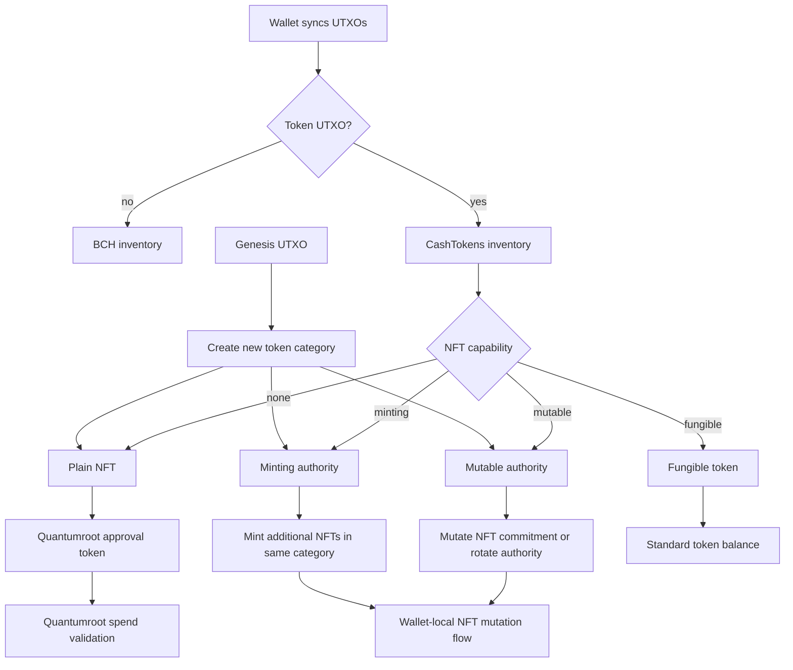

# CashTokens NFT Capability Flow

This document describes the wallet-local CashTokens NFT capability flow we are
building in OPTN Wallet.

## Goals

- Treat plain NFTs, mutable authorities, and minting authorities as distinct
  wallet capabilities.
- Allow wallet-local minting and mutation flows without waiting on libauth
  updates.
- Keep Quantumroot on the plain-NFT path for now.
- Show mempool token UTXOs the same way we show confirmed token UTXOs.

## Flow

## Operational notes

- A genesis UTXO creates the category.
- A minting authority can create more NFTs in the same category.
- A mutable authority can recreate one successor NFT with updated commitment.
- A plain NFT is the end-product that Quantumroot uses for approval / spend
  gating.
- Mempool UTXOs are included in the token inventory so the UI can reflect local
  broadcasts before confirmation.

## User-facing rule of thumb

- If you want to create a new category, start from a genesis UTXO.
- If you want to mint more NFTs from an existing category, use a minting
  authority.
- If you want to rotate the authority / metadata path, use a mutable authority.
- If you want to use Quantumroot, select or create a plain NFT.
