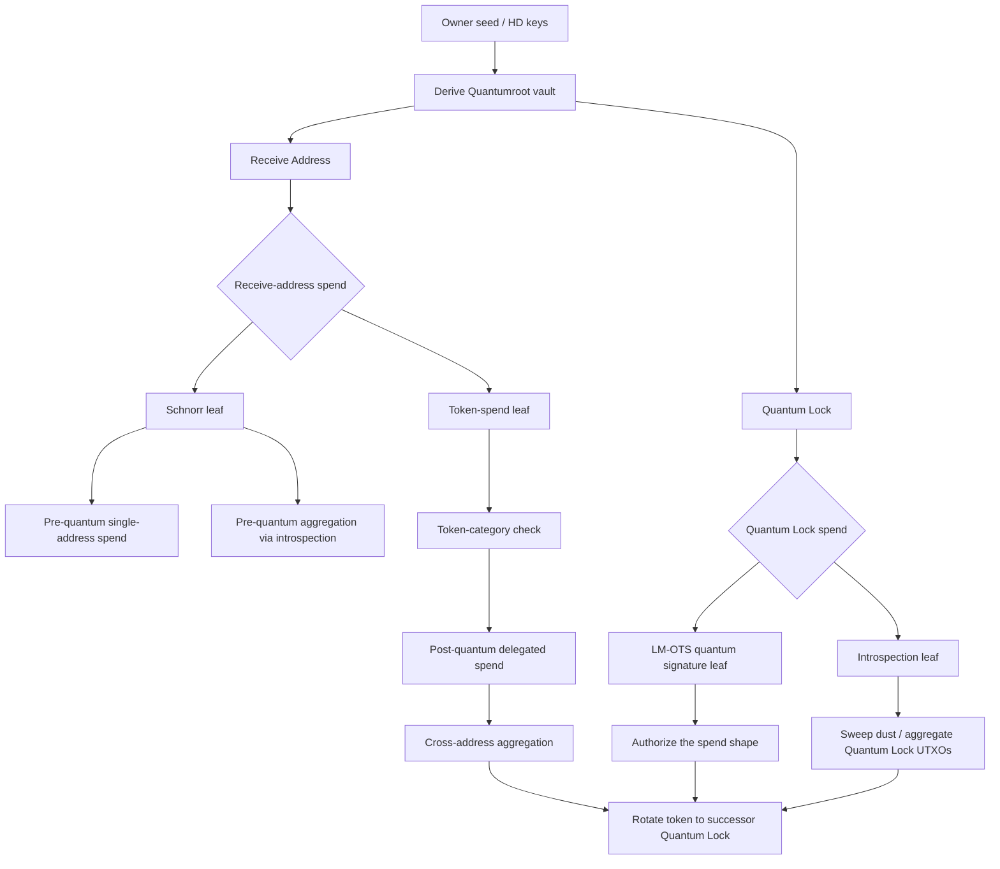

# Quantumroot Flow Chart

This document summarizes the reference Quantumroot design from
`/home/lightswarm/projects/reference/quantumroot`.
It is intentionally generic and does not describe any OPTN Wallet-specific UI.

## Flow Chart

## How The Design Works

- Quantumroot derives two user-visible address types from one wallet seed:
  - `Receive Address`
  - `Quantum Lock`
- The receive address has two spend paths:
  - a Schnorr path for the normal pre-quantum case
  - a token-spend path for the delegated post-quantum case
- The Quantum Lock has two spend paths:
  - an LM-OTS quantum-signature path
  - an introspection path for matching and aggregating Quantum Lock UTXOs
- The post-quantum path uses a CashToken category as the delegated authorization handle.
- The quantum signature does not sign coins directly; it signs the expected transaction shape.
- Aggregation is a design goal:
  - pre-quantum aggregation works across UTXOs from the same receive address
  - post-quantum aggregation can combine token-spend receive inputs and Quantum Lock authorization in one transaction
- The authorization token is rotated forward to the successor Quantum Lock after a successful spend.

## Spend Paths

### Pre-Quantum

1. Funds arrive at the Receive Address.
2. The wallet spends them through the Schnorr leaf, or aggregates same-address UTXOs through introspection.
3. The transaction is broadcast with no quantum-specific token flow.

### Post-Quantum

1. A vault token category is created or selected.
2. A matching CashToken is placed on the receive side to delegate authorization.
3. The wallet builds a transaction that includes the Quantum Lock authorization input and one or more token-spend receive inputs.
4. The Quantum Lock branch verifies the transaction shape with LM-OTS.
5. The spend succeeds and the token is carried to the next Quantum Lock.

### Quantum Lock Cleanup

1. If Quantum Lock accumulates dust or stray UTXOs, the introspection branch can sweep them.
2. That branch keeps the design flexible without exposing receive-address connections.

## Key Concepts

- `Receive Address`: the public inbound address users can share.
- `Quantum Lock`: the hidden authorization address that should only hold delegated token authorization.
- `vault_token_category`: the CashToken category used to delegate authorization.
- `quantum_lock_verify_transaction_shape`: the script hash the LM-OTS signature commits to.
- `token_spend_index`: the offset used to identify the token-spend leaf in the transaction shape.

## Notes

- This reference design is a CashAssembly implementation of a quantum-secure vault pattern, not a generic account wallet.
- The design relies on transaction-shape verification, token delegation, and address rotation.
- For deeper implementation details, see the reference repo README and demo transaction generator.
